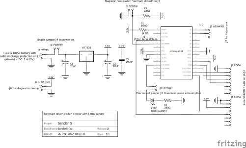

# SenderReceiver
## Sender 5 (433 MHz LoRa)
Sensor for the slot of a mailbox. When the slot is opened, a magnetic reed switch triggers and sends a LoRa signal to the receiver. Additionally once per day the current battery voltage and the magnetic reed switch state will also be sent to the receiver.

Hardware:
* Microcontroller ATmega328P-PU (without crystal, in 8 MHz-RC mode. Board manager: "ATmega328 on a breadboard (8 MHz internal clock)" ) 
* HT7333 voltage regulator
* Lora SX1278 Ra-02 (433 Mhz)
* 18650 Battery with integrated protection against deep discharge
* Magnetic reed-switch "normaly closed" with external pullup resistor (2M)
* Control LED (blinks every 8 seconds) which can be enabled/disabled by a physical jumper J8

[Arduino-Sketch](/Sender5/Sender5.ino)

