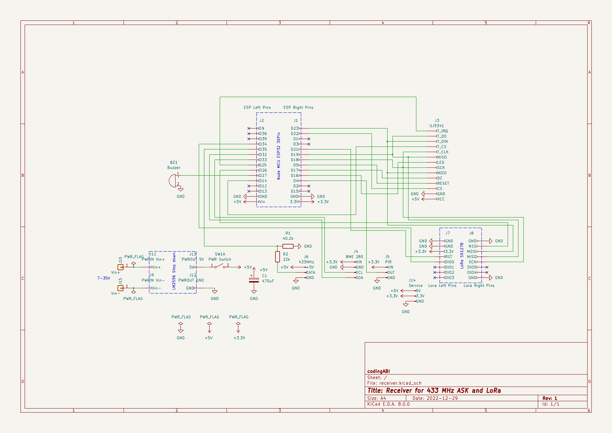

# SenderReceiver
Receiver and senders to monitor environmental data like temperature, humidity ... window and mailbox states.

This project is not a "step-by-step"-guide. It is more a documentation of my devices. 
## ASK
ASK (Amplitude-Shift Keying) is a simple signal modulation, which is used in cheap 433 MHz modules like the FS1000A.
## LoRa
LoRa is more sophisticated then ASK and was needed in this project, because ASK signals from inside the metal mailbox were not received reliably by the Receiver in my environment.
## Appendix
### Receiver (433 MHz ASK and LoRa)
Description:
* Receives sensor data by 433MHz ASK or LoRa signals
* Saves them to local csv files 
* Forwards some sensor data to Blynk
* Displays some sensor data on a touch display 
* Provides a webserver to show sensor data in a browser 

Hardware: 
* ESP-WROOM-32 NodeMCU (Board manager: ESP32 Dev Model, Baud 115200)
* ILI9341 TFT with XPT2046-Touch
* PIR sensor AM312 to wake up the display from screensaver
* Passive buzzer
* RXB6 433MHz receiver (At the beginning I used a MX-05v, but this receiver was too bad)
* BME280 sensor for pressure, temperature and humidity
* Lora SX1278 Ra-02
* LM2596 Step down voltage converter
* Old 12V DC power supply as input for LM2596 (Power consumption on 230V side: 1.6W when TFT is on, 0.8W when TFT is off)
* Self-designed PCB

[Arduino-Sketch](/Receiver)

Wooden self-made case with TFT on first layyer.

The PCB will be stacked on the TFT

The BME280 is outside the case, because the ESP32 produces too much heat.

### Sender 1 (433 MHz ASK)
Sends temperature, humidity and battery state of the staircase every 30 minutes via a 433MHz-ASK signal to a receiver

Hardware:
* Microcontroller ATmega328P (without crystal, in 8 MHz-RC mode. Board manager: "ATmega328 on a breadboard (8 MHz internal clock)" ) 
* DHT22 sensor
* 433MHz FS1000A sender (distance to receiver ~3m without line of sight with one wall between)
* 3x AA-Batteries without voltage regulation (I use rechargeable AAs and the runtime is ~8 month)
* Control LED (blinks every 8 seconds) which can be enabled by a physical jumper
* Self-designed PCB

[Arduino-Sketch](/Sender1/Sender1.ino)

Case for the whole device is a piece (~36cm) standard PVC 25mm installation  tube. The three AA batteries are in a piece (~18cm) standard PVC 20mm installation tube.

### Sender 3 (433 MHz ASK)
Magnetic reed switch sensor to detect, if a window is closed, open or tilted. Sends the window state, outdoor temperature, humidity and battery state every 30 minutes or triggered by magnetic reed switch change via a 433MHz-ASK to a receiver.

Hardware:
* Microcontroller ATmega328P (without crystal, in 8 MHz-RC mode. Board manager: "ATmega328 on a breadboard (8 MHz internal clock)" ) 
* DHT22 sensor
* 433MHz FS1000A sender (distance to receiver ~4m without line of sight with one wall between)
* 3x AA-Batteries without voltage regulation (I use non-rechargeable AAs, because the sender is outside the house, runtime > 1 year)
* Control LED (blinks every 8 seconds) which can be enabled by a physical jumper
* Two magnetic reed switches "normally closed" to detect the window state
* Self-designed PCB

[Arduino-Sketch](/Sender3/Sender3.ino)

Case for the 3xAA batteries is a piece (~18cm) standard PVC 20mm installation tube

Case for the device is a piece (~36cm) of a standard PVC 25mm installation tube

### Sender 5 (433 MHz LoRa)
Sensor for a mailbox. When the lid of the slot is opened, a magnetic reed switch triggers and sends a LoRa signal to the receiver. Additionally once per day the current battery voltage and the magnetic reed switch state will also be sent to the receiver.

Hardware:
* Microcontroller ATmega328P (without crystal, in 8 MHz-RC mode. Board manager: "ATmega328 on a breadboard (8 MHz internal clock)" ) 
* HT7333 voltage regulator
* Lora SX1278 Ra-02 (433 MHz, distance to receiver ~5m without line of sight with one wall and a metal case between)
* 18650 Battery with integrated protection against deep discharge
* Magnetic reed-switch "normally closed"
* Control LED which can be enabled/disabled on demand with physical jumper JP2
* Self-made perfboard

[Arduino-Sketch](/Sender5/Sender5.ino)

The sender is in a standard junction box

The device is inside the mailbox

