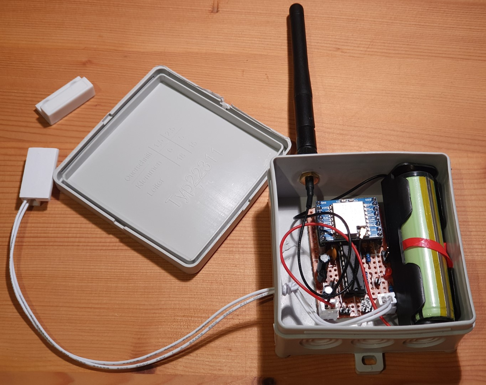

# SenderReceiver
## Sender 5
Sends the magnetic reed-switch state in my mailbox and the battery state triggered by a switch change via LoRa to a receiver. Additionally once per day the current states will also be sent.

Hardware:
* Microcontroller ATmega328P-PU (without crystal, in 8 MHz-RC mode. Board manager: "ATmega328 on a breadboard (8 MHz internal clock)" ) 
* HT7333 voltage regulator
* Lora SX1278 Ra-02
* 18650 Battery with integrated protection against deep discharge
* Magnetic reed-switch "normaly closed" with external pullup resistor (2M)
* Control LED (blinks every 8 seconds) which can be enabled/disabled by a physical jumper J8

