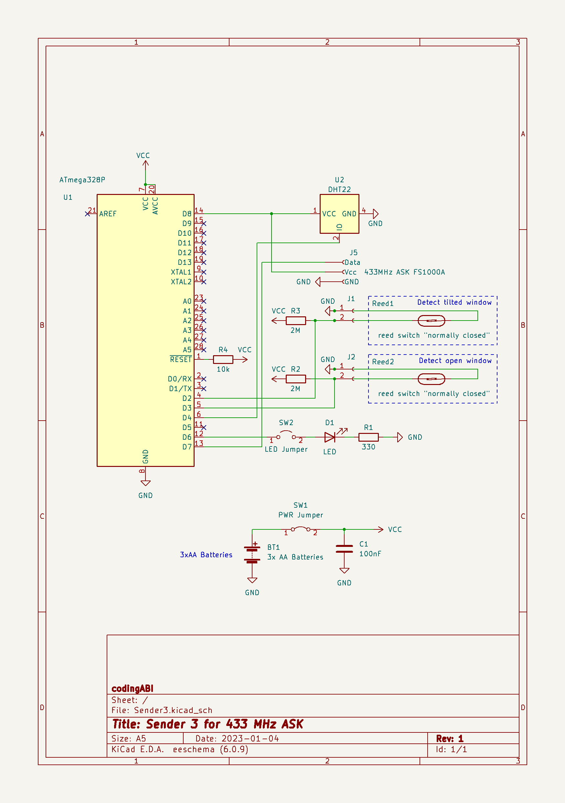

# SenderReceiver
Receiver and senders to monitor environmental data like tempature, humidity ... and window states.

This project is not as "step-by-step"-manual. It is a documention of my real devices. 
## Receiver (433 MHz ASK and LoRa)
To be done...
## Sender 1 (433 MHz ASK)
Sends temperature, humidity and battery state every 30 minutes via a 433MHz-ASK signal to a receiver

Hardware:
* Microcontroller ATmega328P (without crystal, in 8 MHz-RC mode. Board manager: "ATmega328 on a breadboard (8 MHz internal clock)" ) 
* DHT22 sensor
* 433MHz FS1000A sender
* 3x AA-Batteries without voltage regulation (I use rechargeable AAs and the runtime is ~8 month)
* Control LED (blinks every 8 seconds) which can be enabled by a physical jumper
* Selfdesigned PCB

[Arduino-Sketch](/Sender1/Sender1.ino)

Case for the whole device is a pice (~36cm) standard PVC 25mm installation  tube. The three AA batteries are in a pice (~18cm) standard PVC 20mm installation tube.

## Sender 3 (433 MHz ASK)
Magnetic reed switch sensor to detect if a window is open or tilted. Sends the window state, temperature, humidity and battery state every 30 minutes or triggered by magnetic reed switch change via a 433MHz-ASK to a receiver.

Hardware:
* Microcontroller ATmega328P (without crystal, in 8 MHz-RC mode. Board manager: "ATmega328 on a breadboard (8 MHz internal clock)" ) 
* DHT22 sensor
* 433MHz FS1000A sender
* 3x AA-Batteries without voltage regulation (I use nonrechargeable AAs because the sender is outside the house)
* Control LED (blinks every 8 seconds) which can be enabled by a physical jumper
* Two magnetic reed switches "normally closed" to detect the window state
* Selfdesigned PCB

[Arduino-Sketch](/Sender3/Sender3.ino)

Case for the 3xAA batteries is a pice (~18cm) standard PVC 20mm installation tube

Case for the device is a pice (~36cm) of a standard PVC 25mm installation tube

## Sender 5 (433 MHz LoRa)
Sensor for a mailbox. When the lid of the slot is opened, a magnetic reed switch triggers and sends a LoRa signal to the receiver. Additionally once per day the current battery voltage and the magnetic reed switch state will also be sent to the receiver.

Hardware:
* Microcontroller ATmega328P (without crystal, in 8 MHz-RC mode. Board manager: "ATmega328 on a breadboard (8 MHz internal clock)" ) 
* HT7333 voltage regulator
* Lora SX1278 Ra-02 (433 MHz)
* 18650 Battery with integrated protection against deep discharge
* Magnetic reed-switch "normally closed" with external pullup resistor
* Control LED which can be enabled/disabled on demand with physical jumper JP2
* Selfmade perfboard

[Arduino-Sketch](/Sender5/Sender5.ino)

The sender is in a standard junction box

The device is inside the mailbox

