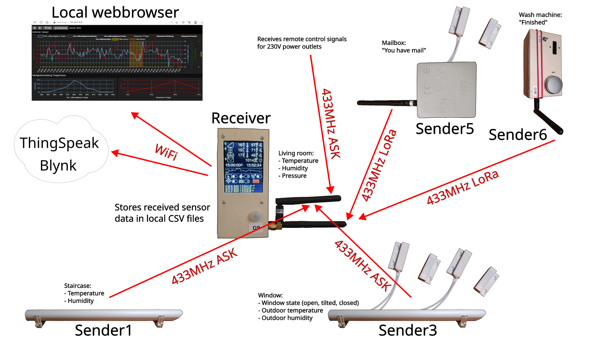
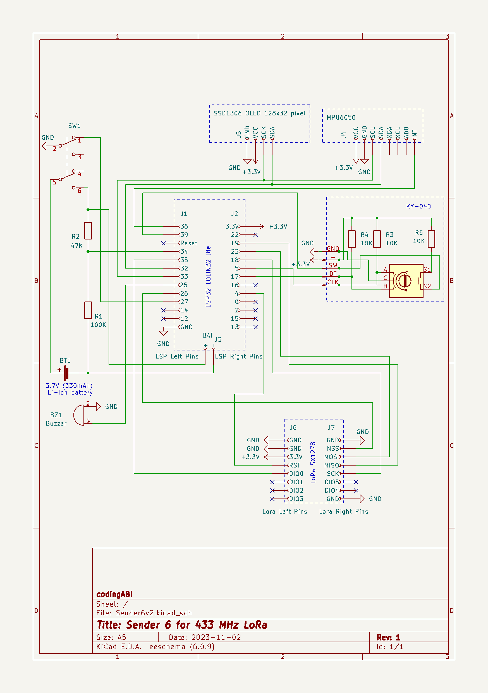

# SenderReceiver
Receiver and senders to monitor environmental data like temperature, humidity ... window, mailbox and wash machine states.

This project is not a "step-by-step"-guide. It is more a documentation of my devices. 

Devices:
- [Receiver](#receiver-433-mhz-ask-and-lora)
- [Sender 1](#sender-1-433-mhz-ask)
- [Sender 3](#sender-3-433-mhz-ask)
- [Sender 5](#sender-5-433-mhz-lora)
- [Sender 6](#sender-6-433-mhz-lora)

## License and copyright
This project (except [externalCode.ino](/Receiver/externalCode.ino) for the Receiver) is licensed under the terms of the 2-Clause BSD License [Copyright (c) 2024 codingABI](LICENSE). 

The code in [externalCode.ino](/Receiver/externalCode.ino) is licensed under the terms of MIT/BSD/FreeBSD License [Written by Limor Fried/Ladyada for Adafruit Industries, Copyright (c) 2012 Adafruit Industries, Copyright (c) 2022 Bodmer (https://github.com/Bodmer)](LICENSE.TFT-eSPI).

Used external libraries from Arduino IDE Library Manager:
* RCSwitch (by sui77,fingolfin) 
* LoRa (by Sandeep Mistry)
* TFT_eSPI (by Bodmer)
* Blynk (by Volodymyr Shymanskyy)
* Adafruit Unified Sensor (by Adafruit)
* Adafruit BME280 Library (by Adafruit)
* Adafruit MPU6050 (by Adafruit)
* Adafruit SSD1306 (by Adafruit)
* DHT sensor library (by Adafruit)

Used external libraries from GitHub
* KY040 (https://github.com/codingABI/KY040 by codingABI)

## Appendix
### Signals
#### ASK
ASK (Amplitude-Shift Keying) is a simple signal modulation, which is used in cheap 433 MHz modules like the FS1000A.
#### LoRa
LoRa is more sophisticated then ASK and was needed in this project, because ASK signals from inside the metal mailbox were not received reliably by the Receiver in my environment. LoRa is also used to send signals from the washing machine in the basement to the Receiver. 

### Receiver (433 MHz ASK and LoRa)
Description:
* Receives sensor data by 433MHz ASK or LoRa signals
* Saves some sensor data to local CSV files 
* Forwards some sensor data to Blynk
* Forwards some sensor data to ThingSpeak
* Displays some sensor data on a touch display 
* Provides a webserver to show sensor data in a browser 

Hardware: 
* ESP-WROOM-32 NodeMCU (Board manager: ESP32 Dev Model)
* ILI9341 TFT with XPT2046-Touch
* PIR sensor AM312 to wake up the display from screensaver (blank screen)
* Passive buzzer
* RXB6 433MHz receiver (At the beginning I used a  MX-RM-5V, but its reception was not good enough)
* BME280 sensor for pressure, temperature and humidity
* Lora SX1278 Ra-02
* LM2596 Step down voltage converter
* Old 12V DC power supply as input for LM2596 (Power consumption on 230V side: 1.6W when TFT is on, 0.8W when TFT is off)
* Self-designed PCB

[Arduino-Sketch](/Receiver/Receiver.ino)

Wooden self-made case with TFT on first layer.

The PCB will be stacked on the TFT

The BME280 is outside the case, because the ESP32 produces too much heat.

### Sender 1 (433 MHz ASK)
Sends temperature, humidity and battery state of the staircase every 30 minutes via a 433MHz-ASK signal to the Receiver

Hardware:
* Microcontroller ATmega328P (without crystal, in 8 MHz-RC mode. Board manager: "ATmega328 on a breadboard (8 MHz internal clock)" ) 
* DHT22 sensor
* 433MHz FS1000A sender (distance to receiver ~3m without line of sight with one wall between)
* 3x AA-Batteries without voltage regulation (I use rechargeable AAs and the runtime is ~10 month)
* Control LED (blinks every 8 seconds) which can be enabled/disabled on demand with physical jumper SW2
* Self-designed PCB

[Arduino-Sketch](/Sender1/Sender1.ino)

Case for the whole device is a piece (~36cm) standard PVC 25mm installation  tube. The three AA batteries are in a piece (~18cm) standard PVC 20mm installation tube.

### Sender 3 (433 MHz ASK)
Magnetic reed switch sensor to detect, if a window is closed, open or tilted. Sends the window state, outdoor temperature, humidity and battery state every 30 minutes or triggered by magnetic reed switch change via a 433MHz-ASK signal to the Receiver.

Hardware:
* Microcontroller ATmega328P (without crystal, in 8 MHz-RC mode. Board manager: "ATmega328 on a breadboard (8 MHz internal clock)" ) 
* DHT22 sensor
* 433MHz FS1000A sender (distance to receiver ~4m without line of sight with one wall between)
* 3x AA-Batteries without voltage regulation (I use non-rechargeable AAs, because the sender is outside the house, runtime > 19 month)
* Control LED (blinks every 8 seconds) which can be enabled/disabled on demand with physical jumper SW2
* Two magnetic reed switches "normally closed" to detect the window state
* Self-designed PCB

[Arduino-Sketch](/Sender3/Sender3.ino)

Case for the 3xAA batteries is a piece (~18cm) standard PVC 20mm installation tube

Case for the device is a piece (~36cm) of a standard PVC 25mm installation tube

### Sender 5 (433 MHz LoRa)
Sensor for a mailbox. When the lid of the slot is opened, a magnetic reed switch triggers and sends a LoRa signal to the Receiver. Additionally once per day the current battery voltage and the magnetic reed switch state will also be sent to the Receiver.

Hardware:
* Microcontroller ATmega328P (without crystal, in 8 MHz-RC mode. Board manager: "ATmega328 on a breadboard (8 MHz internal clock)" ) 
* HT7333 voltage regulator
* Lora SX1278 Ra-02 (433 MHz, distance to receiver ~5m without line of sight with one wall and a metal case between)
* 18650 Battery with integrated protection against deep discharge and 3350mA (Runtime is >2 years)
* Magnetic reed-switch "normally closed"
* Control LED which can be enabled/disabled on demand with physical jumper JP2
* Self-made perfboard

[Arduino-Sketch](/Sender5/Sender5.ino)

The sender is in a standard junction box

The device is inside the mailbox

### Sender 6 (433 MHz LoRa)
Sensor for a washing machine. When the washing machine is finished (when no shaking is detected by an accelerator sensor for a longer period at my over 20 year old Gorenje WA1141 machine) a LoRa signal is sent to the Receiver. 

Hardware:
* Microcontroller ESP32 LOLIN32
* MPU6050 accelerometer and gyroscope
* SSD1306 OLED 128x32 pixel
* KY-040 rotary encoder
* SX1278 LoRa Ra-02 (distance to receiver ~8m without line of sight from basement to first floor)
* 3.7V 330mAh Li-Ion battery
* Two resistors (47k, 100k) for a voltage divider
* Self-made perfboard

[See device in action on Youtube](https://youtu.be/sHEgI06fphE)

[Arduino-Sketch](/Sender6/Sender6.ino)

Wooden self-made case and perfboard

The device is on top of the washing machine during washing

